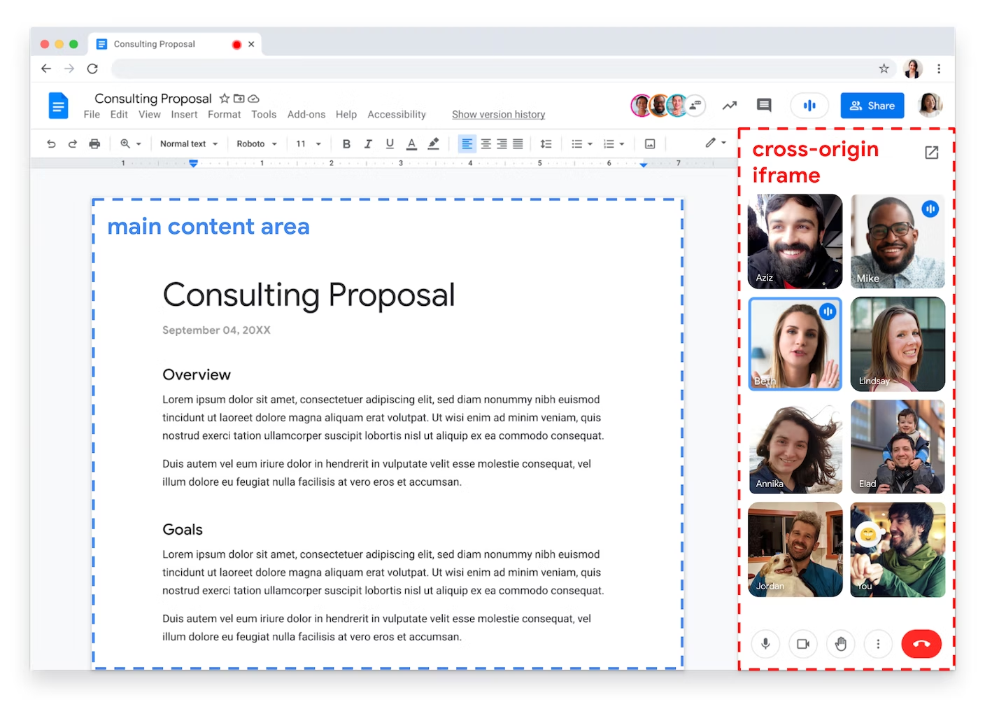
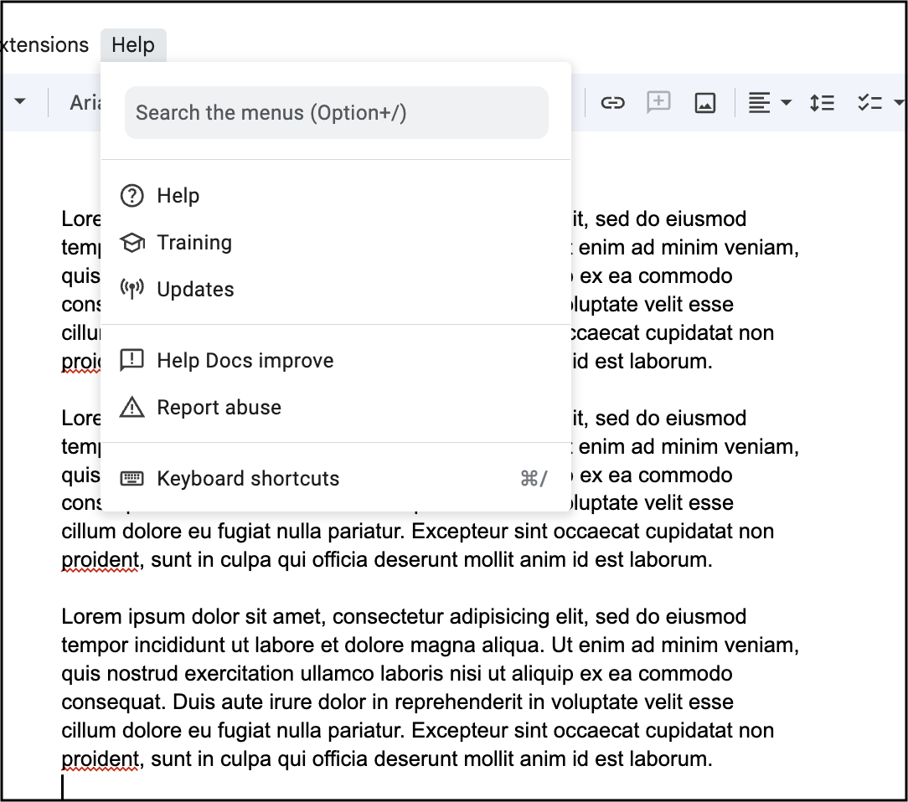

# Element Capture

## Introduction

Pre-existing mechanisms such as [getDisplayMedia()](https://www.w3.org/TR/screen-capture/#dom-mediadevices-getdisplaymedia) allow Web applications to initiate screen-capture. If the user chooses to capture a tab, mechanisms such as [Region Capture](https://w3c.github.io/mediacapture-region/) mutate the resulting video track and perform an operation on all subsequent frames produced. (In the example of [Region Capture](https://w3c.github.io/mediacapture-region/), the operation consists of cropping frames to the frame's intersection with the bounding box of a target-element.)

Element Capture introduces a new mutation mechanism which we name "restriction". When an application "restricts" a video track to a given target-element, frames produced on the restricted video track only consist of information from the target-element and its descendants. Phrased differently, the track becomes a capture of the DOM sub-tree rooted at the target-element.

## What is removed by "restriction"?

When a track is "restricted", three things are removed:

1. Any content from outside of the target element's bounding box.
2. Any content which is occluding the target element.
3. Any content which is occluded by the target element.

## Sample use cases

Consider the following Web application:


This Web app combines a productivity suite and a video conferencing tool. It uses [Region Capture](https://w3c.github.io/mediacapture-region/) to crop away remote participants' own videos before it transmits the main content area to everyone.

But if other HTMLElements end up being drawn on top of the "main content area", they also get captured. This is not always desirable - see the following illustration.

<p align="center">
  </img>
</p>

Element Capture allows this app to capture only the main content area, excluding any occluding content such as drop-down lists.

A partial list of use-cases includes:

- Removing sensitive content from video-captures, such as private messages.
- Removing distracting content from video-captures, such as drop-down lists.
- Client-side rendering.

## Sample Code

Code in the capture-target:

```js
const mainContentArea = navigator.getElementById("mainContentArea");
const restrictionTarget = await RestrictionTarget.fromElement(mainContentArea);
sendRestrictionTarget(restrictionTarget);

function sendRestrictionTarget(restrictionTarget) {
  // Either send the restriction-target using postMessage(),
  // or pass it on locally within the same document.
}
```

Code in the capturing-document:

```js
async function startRestrictedCapture(restrictionTarget) {
  const stream = await navigator.mediaDevices.getDisplayMedia();
  const [track] = stream.getVideoTracks();
  if (!!track.restrictTo) {
    handleError(stream);
    return;
  }
  await track.restrictTo(restrictionTarget);
  transmitVideoRemotely(track);
}
```

## Common questions

### What about the alpha channel?

At the moment, no user agent supports capturing with an alpha channel. That information is absent from the initial capture, prior to restriction. However, it is even more visible that the alpha channel is missing after restriction, as the target element might have been partially transparent, whereas a captured tab would always have some opaque background.

Note that when restricting to a partially transparent target element, the removal of the alpha channel could result in captured content that appears a different color/shade/hue than the local user would perceive, given the background content's effects on the local viewport.

### What is the permission flow?

This API builds on top of existing screen-sharing APIs, meaning that the permission flow remains entirely unchanged. An application would first call `getDisplayMedia()`, `getViewportMedia()`, or any other future screen-sharing API, and the user would first go through the usual selection and consent processes associated with that API. It's only after this process completes, and only if the user shares the (entire) current tab, that the Element Capture API can be invoked.

## Demos

- [element-capture-demo.glitch.me](https://element-capture-demo.glitch.me/)
- [sub-capture-demo.glitch.me](https://sub-capture-demo.glitch.me/)
