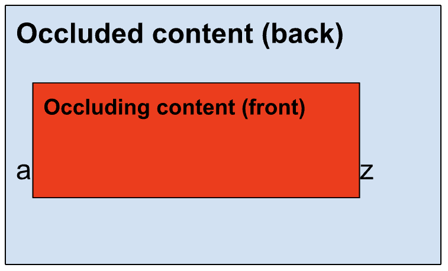
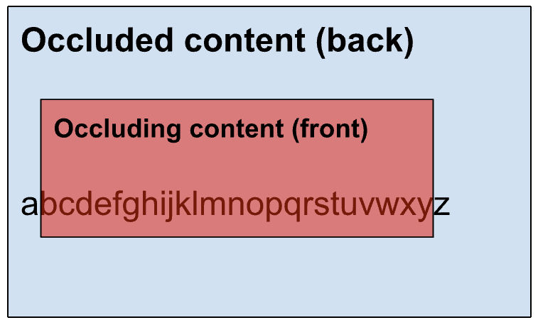

# Element Capture

## Introduction

Pre-existing mechanisms such as [getDisplayMedia()](https://www.w3.org/TR/screen-capture/#dom-mediadevices-getdisplaymedia) allow Web applications to initiate screen-capture. If the user chooses to capture a tab, mechanisms such as [Region Capture](https://w3c.github.io/mediacapture-region/) mutate the resulting video track and perform an operation on all subsequent frames produced. (In the example of [Region Capture](https://w3c.github.io/mediacapture-region/), the operation consists of cropping frames to the frame's intersection with the bounding box of a target-element.)

Element Capture introduces a new mutation mechanism which we name "restriction". When an application "restricts" a video track to a given target-element, frames produced on the restricted video track only consist of information from the target-element and its descendants. Phrased differently, the track becomes a capture of the DOM sub-tree rooted at the target-element.

## What is removed by "restriction"?

When a track is "restricted", three things are removed:

1. Any content from outside of the target element's bounding box.
2. Any content which is occluding the target element.
3. Any content which is occluded by the target element.

## Sample use cases

Consider the following Web application:


This Web app combines a productivity suite and a video conferencing tool. It uses [Region Capture](https://w3c.github.io/mediacapture-region/) to crop away remote participants' own videos before it transmits the main content area to everyone.

But if other HTMLElements end up being drawn on top of the "main content area", they also get captured. This is not always desirable - see the following illustration.

<p align="center">
  </img>
</p>

Element Capture allows this app to capture only the main content area, excluding any occluding content such as drop-down lists.

A partial list of use-cases includes:

- Removing sensitive content from video-captures, such as private messages.
- Removing distracting content from video-captures, such as drop-down lists.
- Client-side rendering.

## Sample usage

The `captureTarget` is an `Element` on your page which contains the content the user wishes to capture. You want the video conferencing web app to capture `captureTarget` and share it with remote participants. So you derive a `RestrictionTarget` from `captureTarget`. After restricting the video track using this `RestrictionTarget`, frames on that video track now consist only of the pixels that are part of `captureTarget` and its direct DOM descendants.

If `captureTarget` changes size, shape or location, the video track follows along, without requiring any additional input from either web app. Occluding content that appears, disappears or moves around, similarly requires no special treatment.

Start out by allowing the user to capture the current tab.

```js
// Ask the user for permission to start capturing the current tab.
// In the future, this should be done with getViewportMedia().
const stream = await navigator.mediaDevices.getDisplayMedia({
  selfBrowserSurface: "include",
});
const [track] = stream.getVideoTracks();
```

Define a `RestrictionTarget` by calling `RestrictionTarget.fromElement()` with an element of your choice as input.

```js
// Associate captureTarget with a new RestrictionTarget
const captureTarget = document.querySelector("#captureTarget");
const restrictionTarget = await RestrictionTarget.fromElement(captureTarget);
```

Then call `restrictTo()` on the video track with the `RestrictionTarget` as the input. Once the last promise resolves, all subsequent frames will be restricted.

```js
// Start restricting the self-capture video track using the RestrictionTarget.
await track.restrictTo(restrictionTarget);
```

You can now do anything you'd like with this restricted track; for example, you could transmit it remotely.

### Deep dive

#### Feature detection

To check if `RestrictionTarget.fromElement()` is supported, use:

```js
if ("RestrictionTarget" in self && "fromElement" in RestrictionTarget) {
  // Deriving a restriction target is supported.
}
```

#### Derive a RestrictionTarget

Focus on the `Element` called `captureTarget`. To derive a RestrictionTarget from it, call `RestrictionTarget.fromElement(captureTarget)`. The returned promise will be resolved with a new `RestrictionTarget` object if successful.

```js
const captureTarget = document.querySelector("#captureTarget");
const restrictionTarget = await RestrictionTarget.fromElement(captureTarget);
```

Unlike an `Element`, a `RestrictionTarget` object is [serializable](https://developer.mozilla.org/en-US/docs/Glossary/Serializable_object). It can be passed to another document using [`Window.postMessage()`](https://developer.mozilla.org/en-US/docs/Web/API/Window/postMessage), for instance.

#### Restricting

When capturing a tab, the video track exposes `restrictTo()`. When capturing the current tab, it is valid to call `restrictTo()` with either `null` or any `RestrictionTarget` derived from an `Element` within the current tab.

Calls to `restrictTo(restrictionTarget)` mutate the video track into a capture of `captureTarget`, as though it were drawn by itself, independently of the rest of the DOM. Any descendants of `captureTarget` are also captured; siblings of `captureTarget` are eliminated from the capture. The result is that any frames delivered on the track appear as though they were cropped to the contours of `captureTarget`, and any occluding and occluded content are removed.

```js
// Start restricting the self-capture video track using the RestrictionTarget.
await track.restrictTo(restrictionTarget);
```

Calls to `restrictTo(null)` revert the track to its original state.

```js
// Stop restricting.
await track.restrictTo(null);
```

If the call to `restrictTo()` is successful, the returned promise is resolved when it can be guaranteed that all subsequent video frames will be restricted to `captureTarget`.

If unsuccessful, the promise is rejected. An unsuccessful call to `restrictTo()` will be for one of the following reasons:

- If the `restrictionTarget` was minted in a tab other than the one being captured.
- If the `restrictionTarget` was derived from an Element that no longer exists.
- If the current track is not a self-capture video track. (Future extensions to restricting other tabs are considered but not planned.)
- If the Element from which `restrictionTarget` was derived is not [eligible for restriction]().

#### Eligible and ineligible capture targets

It is always possible to start restricting a track to any valid capture-target. However, frames won't be produced under [certain conditions](https://screen-share.github.io/element-capture/#elements-eligible-for-restriction); for example, if the element or an ancestor is `display: none`. The general rationale is that restriction applies only to an element that comprises a single, cohesive, two-dimensional, rectangular area, whose pixels can be logically determined in isolation from any parent or sibling elements.

One important consideration for ensuring the element is eligible for restriction, is that it must form its own [stacking context](https://developer.mozilla.org/en-US/docs/Glossary/Stacking_context). To ensure this, you could specify the [isolation](https://developer.mozilla.org/en-US/docs/Web/CSS/isolation) CSS property, setting it to `isolate`.

```html
<div id="captureTarget" style="isolation: isolate;"></iframe>
```

Note that the target element can toggle between being eligible and ineligible for restriction at any arbitrary point, for example, if the app changes its CSS properties. It's up to the app to use reasonable capture targets and avoid changing their properties unexpectedly. If the target element becomes ineligible, new frames will simply not be emitted on the track until the target element again becomes eligible for restriction.

## Common questions

### Occluding content? Occluded content?

Occluding content is content which is drawn on top of other content. In the following example, the red rectangle is occluding content.

<p align="center">
  </img>
</p>

Occluded content is content which is partially obscured by other content. In the example above, the letters between A and Z (exclusive) are occluded by the red rectangle.

To keep things interesting, consider partial transparency. In the illustration below, the occluding content is partially transparent. If Element Capture were used here to target the red rectangle, none of the content from the blue rectangle should be captured.

<p align="center">
  </img>
</p>

### What about the alpha channel?

At the moment, no user agent supports capturing with an alpha channel. That information is absent from the initial capture, prior to restriction. However, it is even more visible that the alpha channel is missing after restriction, as the target element might have been partially transparent, whereas a captured tab would always have some opaque background.

Note that when restricting to a partially transparent target element, the removal of the alpha channel could result in captured content that appears a different color/shade/hue than the local user would perceive, given the background content's effects on the local viewport.

### What is the permission flow?

This API builds on top of existing screen-sharing APIs, meaning that the permission flow remains entirely unchanged. An application would first call [`getDisplayMedia()`](https://www.w3.org/TR/screen-capture/), [`getViewportMedia()`](https://w3c.github.io/mediacapture-viewport/), or any other future screen-sharing API, and the user would first go through the usual selection and consent processes associated with that API. It's only after this process completes, and only if the user shares the (entire) current tab, that the Element Capture API can be invoked.

### What about audio?

This API only deals with video tracks (as did [Region Capture](https://w3c.github.io/mediacapture-region/)). No extension of this work to deal with audio is expected; that would be a completely separate effort, and would likely employ a different approach.

## Alternatives considered

### Rejected alternative: Capture-specific-element API

We have considered shaping the API along the lines of `element.capture()`.

We preferred the restriction-model instead due to multiple reasons, among them:

1. It is desirable to hook into established patterns in obtaining the user's informed consent.
1. Prompting the user to share anything other than the entire current tab, might mislead the users into thinking that they were granting permission to capture only what they currently see; in reality, the target element might have sub-elements that can be navigated, like iframes.
1. It is useful to be able to switch between target-elements without having to prompt the user again.
1. We wanted a convenient way to anchor the API to up-and-coming APIs such as [`getViewportMedia()`](https://w3c.github.io/mediacapture-viewport/) and the security mechanisms they intend to provide.
1. We see it as idiomatic and egonomic to shape the API along the lines of such established adjacent APIs as [Region Capture](https://w3c.github.io/mediacapture-region/).
1. The current API shape lends itself to a potential future extension, that might allow restricting a track obtained from capturing _another_ tab.

## Demos

- [element-capture-demo.glitch.me](https://element-capture-demo.glitch.me/)
- [sub-capture-demo.glitch.me](https://sub-capture-demo.glitch.me/)
